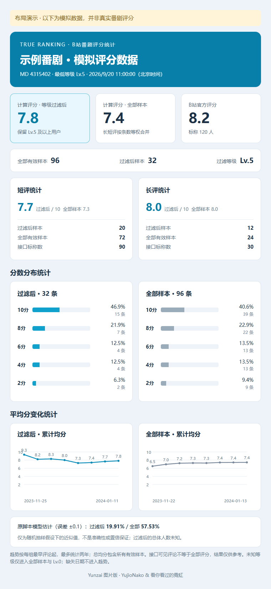

# true_ranking_plugin
通过获取b站番剧长短评计算实际的评分数据，适用于Yunzai-Bot，核心代码来自Bilibili@看你看过的霓虹

现已增加油猴脚本与浏览器脚本，方便在浏览器上使用

## 网页应用

**[打开 True Ranking 番剧评分观察室](https://yujionako.github.io/true_ranking_plugin/)**

纯静态应用位于 `docs/`，支持 GitHub Pages，无构建依赖，不需要配置密钥。网页、油猴、控制台和 Yunzai 图片版均可独立使用。

### 实时统计

1. 在浏览器安装 Tampermonkey，并允许用户脚本运行。
2. [安装或更新网页连接助手](https://yujionako.github.io/true_ranking_plugin/true-ranking-bridge.user.js) 至 **1.1.0 或更新版本**，刷新网页。仅刷新网页不会更新已安装的旧版脚本。
3. 在同一浏览器配置中登录 B 站，回到网页点击「检测登录状态」；确认会话后输入 `md4315402`、`ep705756`、`ss26257` 或对应完整番剧链接，点击开始统计。
4. 调整最低用户等级（0–6）即时重新计算，查看长短评明细、六项置信度模型估计、分数分布及最早评论起两年的累计趋势。

GitHub Pages 不能直接跨域读取 B 站 API。连接助手通过 Tampermonkey 的跨域请求能力访问限定的评分接口，由扩展自动携带当前浏览器的 B 站 Cookie（`anonymous: false`，支持的版本同时使用 B 站 Cookie 分区）。Cookie 只发往 B 站，不读取、复制到网页、存储到本站或传给代理。登录检测仅返回是否登录，不返回账户详情；评分响应也仅保留统计必需字段。安装连接助手不会修改原有油猴脚本。

**遇到 412：** 旧版 1.0.0 强制匿名请求，无法使用现有登录会话。请先升级连接助手，再登录 B 站并检测会话。HTTP 412 / 429 或接口 -412 / -509 会停止采集，并暂停助手请求至少 60 秒，不自动重试。分页间隔已从 350 ms 调整为 1200 ms。412 也可能来自网络、频率等风控，登录不保证解除；请在 B 站页面处理其提示的验证，稍后手动重试。已登录但检测不到会话时，确认是同一浏览器配置（而非另一个配置或隐私窗口），并更新 Tampermonkey。代理模式不能使用本机 Cookie。

不支持扩展的设备可使用自己的 HTTPS CORS 代理（选择「自定义代理」），代理接口格式为 `代理前缀 + https://api.bilibili.com/接口路径`，例如 `https://your-server.example/proxy/https://api.bilibili.com/pgc/review/user?media_id=4315402`。代理需返回原始 JSON 和允许网页来源的 CORS 头。仓库原脚本的更新代理不作为网页默认数据服务。

### 数据与统计口径

- 默认过滤低于 Lv.5 的样本，Lv.0 表示不按等级过滤。缺失或非法等级、非法评分的记录不纳入计算。
- 每类评论按评论 ID 去重；同一用户的长评与短评仍作为两个样本，与原脚本口径一致。
- API 可见分页读完不代表全体评分已采集。采集评论数和官方评分人数口径不同，比值可能超过 100%。
- 「置信度 · 原脚本模型估计」直接展示合并、短评、长评各自过滤前后的六项概率，保留两位小数。沿用油猴版误差 ±0.1 的正态近似公式：合并以官方评分人数为标称数，短评、长评分别使用对应接口标称数；切换等级立即重算。样本不足或标称数不可用时说明原因；原公式返回 100% 的特殊情形也单独标注。评论不一定是随机样本，等级过滤后的总体人数未知，这些估计不作为置信保证。
- 趋势图分别展示过滤后和全部样本，每个点直接标注日期、累计均分，可展开数据表；窄屏横向滚动图表。另显示样本保留率及本次采集 / 本机缓存 / 导入数据来源。
- 最近 5 部番剧的数据仅保存在当前浏览器；无账户、遥测或上传。JSON 导入/导出只包含评分、等级、时间，不包含评论正文、昵称或用户 ID。可清除站点数据移除缓存。
- 导入数据无需连接助手或代理；文件上限 30 MB。短链接 `b23.tv` 请先展开成完整番剧链接。

### 开发与部署

使用 Node.js 20+：`npm run dev` 启动 `http://127.0.0.1:4173`，`npm run check` 检查脚本语法，`npm test` 运行统计与网络边界测试。无需 `npm install`。

`.github/workflows/pages.yml` 在 `main` 更新后检查并发布 `docs/`。首次部署需先在仓库 **Settings → Pages → Source** 选择 **GitHub Actions**，然后运行 **Publish True Ranking**；默认工作流令牌不能替你首次启用 Pages。也可移除该部署工作流后选择从 `main` 的 `/docs` 目录直接发布。

连接助手默认只匹配本仓库的 Pages 地址和本地 4173 端口；部署到其他域名时需同步修改它的 `@match`、`@downloadURL` 与 `@updateURL`。

## 使用方法
### Yunzai版
将 [`true_ranking.js`](./true_ranking.js) 复制到机器人的 `plugins/example/true_ranking.js`，替换旧版本后重启。仍是单文件插件，不需要复制 `docs/`、测试文件或手工安装 HTML 模板。

默认发送类似油猴面板的 **PNG 图片**，包括：官方评分、过滤前后计算均分、样本数、短评/长评明细、两组分数分布、两年累计均分趋势，以及原脚本模型估计说明。图片模板首次运行时自动生成在机器人 `data/true-ranking/` 中。

```text
#番剧评分 md4315402
#番剧评分 4315402
#番剧评分 ep705756
#番剧评分 ss26257
#番剧评分 https://www.bilibili.com/bangumi/media/md4315402
#番剧评分 md4315402 等级5
#番剧评分 md4315402 等级0
#番剧评分进度
#番剧评分取消
#番剧评分继续
#番剧评分重来 ep1521592
#番剧评分帮助
```

- 最低等级默认 5，可指定 0–6；`等级0` 不按等级过滤。全部样本的评分口径与旧版保持一致。缺失等级的有效评分仍计入全部样本与 Lv.0，但不进入更高等级的过滤结果；缺失日期不进入趋势。
- 支持完整番剧链接和 `b23.tv` 分享链接。解析分享链接不发送 Cookie，并检查每次重定向目标。
- 使用宿主的 `lib/puppeteer/puppeteer.js` 截图接口，适用于提供该兼容接口的 Yunzai V3 / Miao-Yunzai。需要机器人本身的 Chromium / Puppeteer 可正常截图；Linux 建议安装中文字体，如 Noto Sans CJK。**截图或图片发送失败会自动回退文字结果**。
- 推荐 Node.js 18+；更早的宿主需要自带 `node-fetch`。插件不再绑定特定的 `oicq` / `icqq` 消息库，由宿主截图组件返回图片消息。
- 按机器人账号与查询用户隔离进度，避免多人查询混入另一部番剧结果。同一用户同时只能运行一个任务；多人请求共用至少 3 秒的请求间隔与风控冷却期。单次请求超时 30 秒，每类评论上限 10,000 页，可在文件顶部 `CONFIG` 调整。近 6 万条短评仅分页就可能需要约 2.5 小时，多人查询或风控等待会进一步增加耗时。
- **断点续采：** 每 10 页、阶段完成、重试等待、错误或取消时保存进度至 `data/true-ranking/jobs/`，采用临时文件原子替换。进程重启后发送 `#番剧评分继续` 或重发相同番剧编号，即可继续当前游标；已完成的阶段不再请求。进程被强制终止时，可能需要重读最近约 10 页，评论仍会去重。旧版本已经失败的任务没有进度文件，首次使用新版仍需重新采集。
- `#番剧评分进度` 查看当前阶段、已采页数、有效样本数和冷却剩余时间；`#番剧评分取消` 中止网络请求或等待并保留进度。每位用户保存一个任务；切换未完成的番剧或丢弃损坏的进度时，显式发送 `#番剧评分重来 番剧编号`。相同输入重发可调整过滤等级；已完成后普通查询重新采集，`继续` 可重新生成上次完成的结果。
- **有限恢复：** HTTP 412 / 429 和接口 -352 / -412 / -509 属于风控类，每轮采集最多自动重试两次，分别冷却 120 / 300 秒；成功一页不会重置该风控预算。网络错误、超时、HTTP 408 / 5xx 按 5 / 15 / 45 秒退避，同一请求最多重试三次，每轮最多十次此类重试。遵守更长的 `Retry-After`；超过 15 分钟则直接暂停并保留冷却截止时间。持续失败后需手动继续，避免无限请求；登录失效、权限拒绝及未知错误码直接暂停，不盲目重试。
- B 站尾页有时重复最后一条评论并返回相同游标，而非 `next=0`。只有已读页数覆盖接口标称数量所需页数、尾页不足 20 条且全部已保存，并且间隔至少 3 秒的两次响应一致时，才确认这种尾页结束；重复数据不会再次计数。其他空页、游标循环会等待 15 秒重试一次，仍不推进则按**分页异常**保存并暂停，不提示用户处理风控验证。不会仅凭样本数或标称数推断结束。
- 进度查询会显示新版任务上次暂停的实际原因；只有 HTTP 412 / 429 或接口风控码才提示风控及 Cookie 验证。风控仍需用户在 B 站处理其要求的验证，自动退避不能保证解除。
- 进度文件只保留统计所需字段、去重摘要、游标及任务状态，不保存 Cookie、评论正文或昵称。续采沿用首次查询的官方评分快照，评论可能在采集期间变化；需要全新快照时使用 `重来`。插件热更新会保留新版任务的取消句柄，进程重启不会自动群发或自动续采。

Cookie 默认共用「查成分」插件的 `data/cha_chengfen/bilibili_cookies.txt`（相对于机器人根目录）。每次开始、继续统计，以及自动重试等待结束后都重新读取文件，因此「查成分」刷新 Cookie 后会使用新值，无需重启。文件内容为原始 Cookie 请求头字符串；文件存在但为空、格式异常或不可读时会明确报错，不把内容打印到日志。

管理员也可在**机器人进程环境变量**中设置 `BILIBILI_COOKIE` 覆盖共享文件，或通过 `BILIBILI_COOKIE_FILE` 指定另一份文件；优先级为非空 `BILIBILI_COOKIE` → 指定文件 → 默认共享文件。默认共享文件不存在且未配置覆盖时，仍可匿名查询。服务器不能继承查询用户浏览器里的 B 站登录状态；不要在群聊、源码仓库或截图中放 Cookie。Cookie 只发往固定 B 站 API，不发往分享链接或第三方。登录不保证解除 412 等频率或网络风控。

图片布局预览（模拟数据）：



### 油猴脚本
将`TamperMonkey-trueRanking.js`导入油猴后，在任意番剧页面通过右侧按钮打开面板使用

或者在[Greasyfork脚本网站](https://greasyfork.org/zh-CN/scripts/529380-b站番剧评分统计)快捷安装后，在任意番剧页面通过右侧按钮打开面板使用

### 浏览器脚本
复制`console-trueRanking.js`到浏览器开发者工具的控制台，然后按脚本内说明使用

## 注意
输入的番剧号（md号）指的是番剧详情页面的网址中，“https://www.bilibili.com/bangumi/media/md” 后面跟着的那一串数字；

如三体动画的：https://www.bilibili.com/bangumi/media/md4315402 ，番剧号就是4315402，使用插件时发送 #番剧评分 4315402 即可

<b>现在直接在#番剧评分 后面贴分享链接（含ep号）也可以计算评分了</b>

此外，因为无法获取到所有数据，所谓“真实评分”可能是有偏差的，结果仅供参考，与核心代码作者及YujioNako无关

对于Yunzai版的用户，针对报错fetch is not defined，可以参考这个>>>https://github.com/ldcivan/Yunzai_imgSearcher/issues/3
## 示例
### Yunzai 旧版文字输出（历史示例）


### 油猴脚本
#### 整体效果


#### 面板细节展示


## 其他
感谢：

* [官方Yunzai-Bot-V3](https://github.com/Le-niao/Yunzai-Bot) : [Gitee](https://gitee.com/Le-niao/Yunzai-Bot)
  / [Github](https://github.com/Le-niao/Yunzai-Bot)
* [看你看过的霓虹](https://space.bilibili.com/295614485) : [【技术】还三体动画一个公道！](https://www.bilibili.com/video/BV1WG4y117mz)
